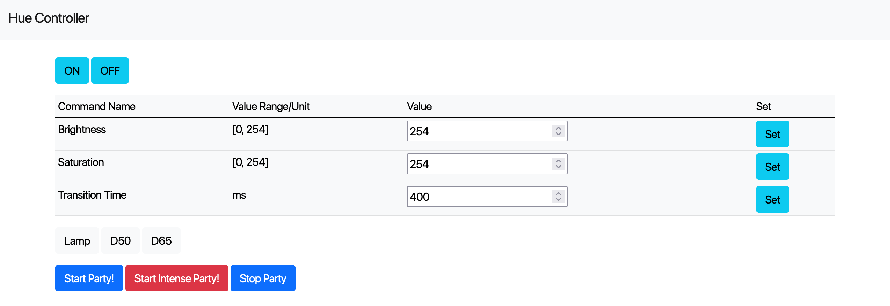

# Hue Controller

controls [Philips Hue](https://www.philips-hue.com/en-us) from your browser



## Usage

First, you have to create `.env` file to store your original information.
Here, `.env` file example is:

```text
BRIDGE_IP_ADDR=<your bridge IP address (see official guides)>
USERNAME=<your username (see official guides)>
GROUP=1
```

Open your terminal and type the following commands:

```console
pip install -r requirements.lock
export FLASK_APP=hue-controller
# if needed:
# export FLASK_ENV=development
flask run
```

And visit `http://localhost:5000`.

Any buttons in index page SHOULD work as they are.
Here, the word "Party" in buttons mean gradation.
For example, "Start Party!" button works like the following:


## Links

- [Flask](https://flask.palletsprojects.com/en/2.0.x/)
- [Philips Hue Developer Site](https://developers.meethue.com/)
